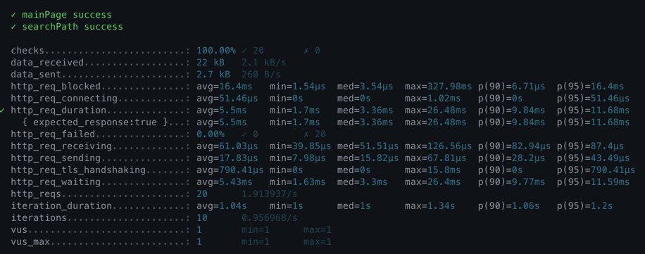
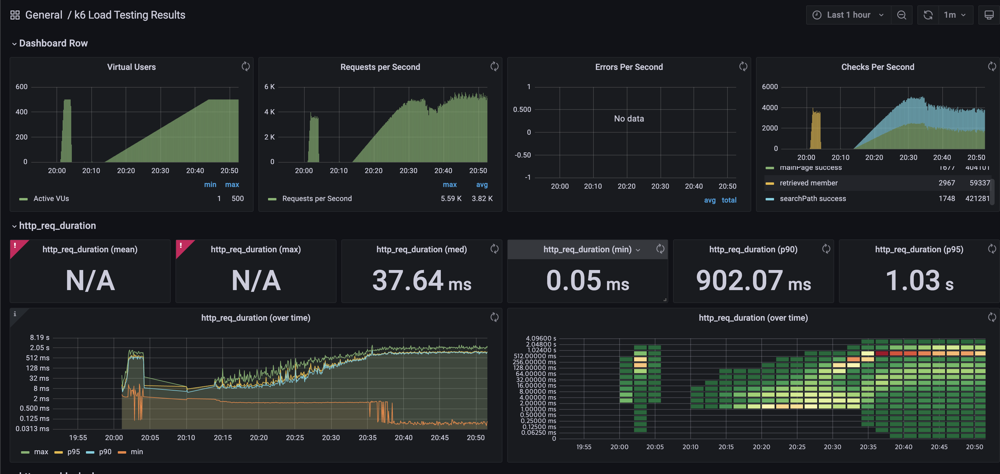
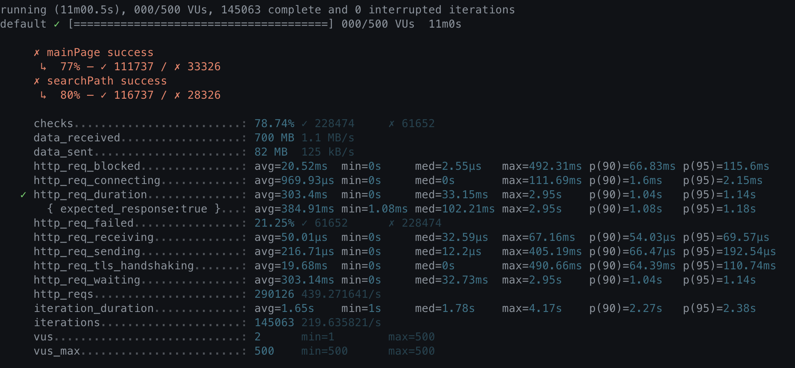

<p align="center">
    
</p>
<p align="center">
  
  
  <a href="https://edu.nextstep.camp/c/R89PYi5H" alt="nextstep atdd">
    
  </a>
  
</p>

<br>

# 인프라공방 샘플 서비스 - 지하철 노선도

<br>

## 🚀 Getting Started

### Install
#### npm 설치
```
cd frontend
npm install
```
> `frontend` 디렉토리에서 수행해야 합니다.

### Usage
#### webpack server 구동
```
npm run dev
```
#### application 구동
```
./gradlew clean build
```
<br>


### 1단계 - 웹 성능 테스트
1. 웹 성능예산은 어느정도가 적당하다고 생각하시나요
- 지하철 노선도 특성상, 사용자 입력이 있는 경로 검색이 핵심 기능이기 때문에, TTI 지표가 중요하다 생각합니다.
- pagespeed 검사결과 TTI가 3초 정도 나오는데, 경쟁사보다 1.6초 정도 더 빠릅니다. 최적화를 통해 0.1초라도 더 줄였으면 좋겠습니다.
  - TTI: 4.6s (https://map.naver.com/v5/subway)
- 점수 또한 65점으로 나타나는데, 최소 70점 이상은 맞고싶네요.

3. 웹 성능예산을 바탕으로 현재 지하철 노선도 서비스는 어떤 부분을 개선하면 좋을까요
   - /js/vendors.js 파일 용량이 가장 큰데, http 인코딩을 gzip 하여 전송하면 빨라질거같습니다.
   - 캐시 정책을 적용하여 재방문시 속도가 빨라지도록 합니다. 
---

### 2단계 - 부하 테스트 
1. 부하테스트 전제조건은 어느정도로 설정하셨나요
   1. RPS 계산 
      - 1명당 1일 평균 접속 혹은 요청 수 예상
          - 출근, 퇴근시간에 하루 평균 2회 접속할 것으로 예상.
      - Throughput: 1일 평균 rps ~ 1일 최대 rps
          - 1일 사용자 수(DAU) x 1명당 1일 평균 접속 수 = 1일 총 접속 수
              - 500만명*2=1000만

          - 1일 총 접속 수 / 86,400 (초/일) = 1일 평균 rps
              - 평균 약 115

          - 1일 평균 rps x (최대 트래픽 / 평소 트래픽) = 1일 최대 rps
              - 115 * (10) = 1150
   2. VUser
      - 내부망에서 테스트하였고, curl 결과 평균 80ms 소요.
      - VUser = (1000 * 0.08) / 2 = 160


2. Smoke, Load, Stress 테스트 스크립트와 결과를 공유해주세요

- Smoke Test

``` shell
import http from 'k6/http';
import { check, group, sleep, fail } from 'k6';

export let options = {
  vus: 1, // 1 user looping for 1 minute
  duration: '10s',

  thresholds: {
    http_req_duration: ['p(99)<1000'], // 99% of requests must complete below 1.5s
  },
};

const BASE_URL = 'https://dongbin.tk';

export default function () {
        mainPage()
        searchPath()
        sleep(1)
};

function mainPage() {
  const response = http.get(`${BASE_URL}`)
  check(response, {
    'mainPage success': (resp) => resp.status === 200
  })
}

function searchPath() {
  const response =  http.get(`${BASE_URL}/paths/?source=1&target=2`)
  check(response, {
    'searchPath success': (resp) => resp.status === 200
  })
}

```

- Load Test

```shell
import http from 'k6/http';
import { check, group, sleep, fail } from 'k6';

export let options = {
  stages: [
    { duration: '30m', target: 500 }, 
    { duration: '10m', target: 500 }, 
    { duration: '1m', target: 0 }, 
  ],
  thresholds: {
    http_req_duration: ['p(99)<1500'], // 99% of requests must complete below 1.5s
  }
};

const BASE_URL = 'https://dongbin.tk';

export default function () {
        mainPage()
        searchPath()
        sleep(1)
};

function mainPage() {
  const response = http.get(`${BASE_URL}`)
  check(response, {
    'mainPage success': (resp) => resp.status === 200
  })
}

function searchPath() {
  const response =  http.get(`${BASE_URL}/paths/?source=1&target=2`)
  check(response, {
    'searchPath success': (resp) => resp.status === 200
  })
}
```

- Stress Test

```shell
import http from 'k6/http';
import { check, group, sleep, fail } from 'k6';

export let options = {
  stages: [
    { duration: '5m', target: 500 }, // simulate ramp-up of traffic from 1 to 100 users over 5 minutes.
    { duration: '5m', target: 500 }, // stay at 100 users for 10 minutes
    { duration: '1m', target: 0 }, // ramp-down to 0 users
  ],
  thresholds: {
    http_req_duration: ['p(99)<1500'], // 99% of requests must complete below 1.5s
  }
};

const BASE_URL = 'https://dongbin.tk';

export default function () {
        mainPage()
        searchPath()
        sleep(1)
};

function mainPage() {
  const response = http.get(`${BASE_URL}`)
  check(response, {
    'mainPage success': (resp) => resp.status === 200
  })
}

function searchPath() {
  const response =  http.get(`${BASE_URL}/paths/?source=1&target=2`)
  check(response, {
    'searchPath success': (resp) => resp.status === 200
  })
}
```
---

### 3단계 - 로깅, 모니터링
1. 각 서버내 로깅 경로를 알려주세요

2. Cloudwatch 대시보드 URL을 알려주세요
